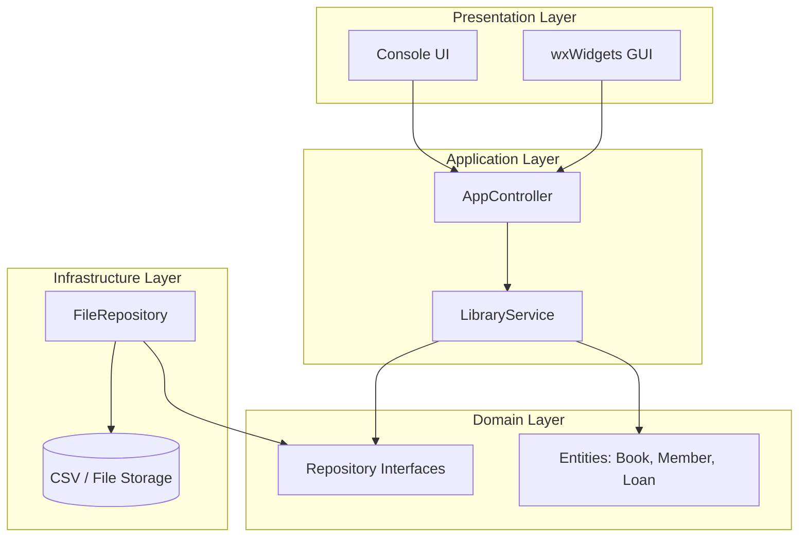

# LibTrack-CPP: modern Library Management System
   

**LibTrack-CPP** is a robust, modular Library Management System engineered to demonstrate modern C++ application architecture. It features a clean separation of concerns, a domain-driven design, and supports dual interfaces: a lightweight **CLI** tools and a rich desktop **GUI** powered by wxWidgets.

---

## Architectural Overview
The project follows a **Layered Architecture** (Clean Architecture inspired) to ensure maintainability, testability, and scalability. The core logic is decoupled from the UI, allowing the same business rules to power both the Console and GUI applications.



### Directory Structure
*   **`domain/`**: Pure business logic and entities (`Book`, `Member`, `Loan`). extensive use of modern C++ standard types.
*   **`app/`**: Application logic and use cases. `LibraryService` coordinates business operations, while `AppController` manages application lifecycle.
*   **`infra/`**: Infrastructure implementation. `FileRepository` provides persistent storage, implementing interfaces defined in the domain layer.
*   **`ui/`**: Text-based Console User Interface.
*   **`gui/`**: Graphical User Interface implementation using **wxWidgets**.
*   **`main.cpp`**: Entry point for the CLI application.
*   **`CMakeLists.txt`**: Modern CMake configuration handling dependency fetching (`FetchContent` for wxWidgets) and multi-targeting.

---

## Key Features
*   **Dual Interface Support**:
    *   **CLI**: Fast, scriptable text interface for admin tasks.
    *   **GUI**: User-friendly desktop application for librarians.
*   **Book Management**: Add, remove, and list books with metadata (ISBN, Title, Author).
*   **Member Services**: Manage library members and user accounts.
*   **Loan Tracking**: Check-in/Check-out functionality with status tracking.
*   **Persistent Storage**: Automatic data persistence using file-based repositories (JSON/CSV compatible architecture).
*   **Cross-Platform**: Built to run on Windows, Linux, and macOS.

---

## Technical Highlights
*   **Modern C++17**: Utilizes smart pointers (`std::unique_ptr`, `std::shared_ptr`), `std::optional`, and structured bindings.
*   **Dependency Injection**: The `AppController` wires dependencies (Repo -> Service -> UI) at runtime, promoting loose coupling.
*   **CMake Build System**:
    *   Uses `FetchContent` to automatically download and compile dependencies like wxWidgets.
    *   Defines separate targets: `libtrack_core` (static lib), `libtrack_cli`, and `libtrack_gui`.
*   **Repository Pattern**: Abstracts data access, allowing easy swapping of storage backends (e.g., File -> SQL) without changing business logic.

---

## Getting Started

### Prerequisites
*   **C++ Compiler**: GCC, Clang, or MSVC supporting C++17.
*   **CMake**: Version 3.10+.
*   **Git**: For fetching dependencies.

### Build Instructions
1.  **Clone the Repository**:
    ```bash
    git clone https://github.com/Mustafa-M422/libtrack-cpp.git
    cd libtrack-cpp
    ```

2.  **Configure & Build**:
    ```bash
    mkdir build && cd build
    cmake ..
    cmake --build . --config Release
    ```
    *Note: The first build may take longer as it downloads and compiles wxWidgets.*

### Running the Application
*   **Run CLI**:
    ```bash
    ./libtrack_cli     # (or libtrack_cli.exe on Windows)
    ```
*   **Run GUI**:
    ```bash
    ./libtrack_gui     # (or libtrack_gui.exe on Windows)
    ```

---

## Future Roadmap
- [ ] **Database Integration**: Replace `FileRepository` with SQLite for robust data handling.
- [ ] **Network API**: Add a REST API layer (`src/api`) to allow web client connections.
- [ ] **Unit Testing**: Expand test coverage using Google Test.
- [ ] **Search & Filtering**: Advanced search capabilities for better catalog management.

---

## 👨‍💻 Author
**Mustafa** - *C++ Software Engineer*
*A showcase of scalable application design and modern C++ practices.*
